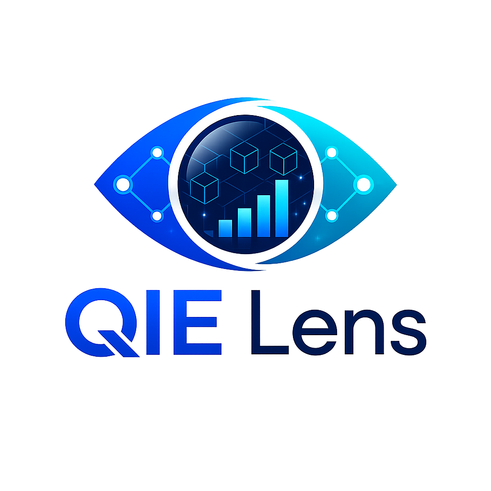
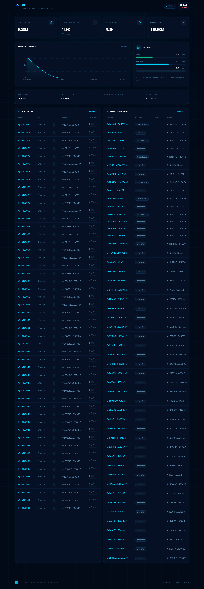

<div align="center">



# 🔍 QIE Lens

**Real-time Blockchain Explorer & Analytics Dashboard for QIE Network**


[🚀 Live Demo](https://qie-lens.vercel.app) · [🎬 Demo Video](https://youtu.be/MqNqHQd06i8) · [📖 QIE Docs](https://docs.qie.digital) · [🔗 Explorer](https://mainnet.qie.digital) · [🐛 Report Bug](https://github.com/ulsreall/qie-lens/issues)

</div>

---

## 🎬 Demo

<div align="center">

[](https://youtu.be/MqNqHQd06i8)

*Click to watch the demo video*

</div>

## 📸 Preview

<div align="center">
  
</div>

## 🎯 Problem

QIE Blockchain lacks a modern, user-friendly analytics dashboard. Existing explorers are functional but not optimized for quick insights — users need to dig through raw data to understand network health, transaction trends, and gas prices.

## 💡 Solution

QIE Lens provides a **clean, real-time dashboard** that surfaces the most important QIE network metrics at a glance:

- **Network health** — block time, utilization, gas prices
- **Transaction activity** — live feed with method decoding
- **Block production** — miner info, gas usage visualization
- **Market data** — QIE price, market cap, price change
- **Deep dive** — block & transaction detail pages
- **Token explorer** — browse top tokens on the network

## ✨ Features

| Feature | Description |
|---------|-------------|
| 📊 **Network Stats** | Total blocks, transactions, addresses, market cap |
| 📈 **Area Chart** | Visual network overview with gradient fills |
| ⛽ **Gas Monitor** | Slow / Average / Fast gas price tracking with progress bars |
| 🧱 **Block Explorer** | Latest blocks with miner info and gas usage bars |
| 💸 **Transaction Feed** | Live transactions with method tags and status badges |
| 🔍 **Search Bar** | Search blocks, transactions, and addresses |
| 📄 **Block Detail** | Full block info at `/block/[id]` |
| 📜 **Transaction Detail** | Full tx info at `/tx/[hash]` |
| 🪙 **Top Tokens** | Token list at `/tokens` |
| 🔄 **Auto-refresh** | ISR with 30s revalidation — always fresh data |
| 📱 **Responsive** | Mobile-first design, works on all screen sizes |
| 🌙 **Dark Theme** | Navy/cyan color scheme matching QIE Lens branding |
| 🚫 **Custom 404** | Branded error page |

## 🛠️ Tech Stack

| Layer | Technology |
|-------|------------|
| **Framework** | Next.js 16 (App Router, Turbopack) |
| **Styling** | Tailwind CSS v4 |
| **Charts** | Recharts (AreaChart) |
| **Icons** | Lucide React |
| **Language** | TypeScript 5 |
| **API** | [QIE Blockscout API v2](https://mainnet.qie.digital/api/v2/) |
| **Deployment** | Vercel |

## 🏗️ Architecture

```
┌─────────────────────────────────────────────────┐
│                   QIE Lens                       │
│              (Next.js 16 App Router)             │
├─────────────────────────────────────────────────┤
│                                                  │
│  ┌──────────┐  ┌──────────┐  ┌──────────┐      │
│  │ StatCard │  │ Network  │  │ GasPrice │      │
│  │ (×4)     │  │ Chart    │  │ Card     │      │
│  └──────────┘  └──────────┘  └──────────┘      │
│                                                  │
│  ┌──────────────────┐  ┌──────────────────┐    │
│  │  BlockTable      │  │  TransactionTable │    │
│  │  (Latest 10)     │  │  (Latest 10)      │    │
│  └──────────────────┘  └──────────────────┘    │
│                                                  │
│  ┌──────────┐  ┌──────────┐  ┌──────────┐      │
│  │ Search   │  │ Block    │  │ Tx       │      │
│  │ Bar      │  │ Detail   │  │ Detail   │      │
│  └──────────┘  └──────────┘  └──────────┘      │
│                                                  │
├─────────────────────────────────────────────────┤
│              QIE Blockscout API v2               │
|          https://mainnet.qie.digital/api/v2      |
└─────────────────────────────────────────────────┘
```

## 📦 Getting Started

```bash
# Clone the repo
git clone https://github.com/ulsreall/qie-lens.git
cd qie-lens

# Install dependencies
npm install

# Start dev server
npm run dev
```

Open [http://localhost:3000](http://localhost:3000) in your browser.

### Build for Production

```bash
npm run build
npm start
```

## 📁 Project Structure

```
qie-lens/
├── public/
│   ├── logo.png              # QIE Lens logo
│   ├── preview.png           # Dashboard screenshot
│   └── demo-final.mp4        # Demo video
├── src/
│   ├── app/
│   │   ├── globals.css       # Tailwind + custom utilities
│   │   ├── layout.tsx        # Root layout + metadata
│   │   ├── page.tsx          # Main dashboard page
│   │   ├── not-found.tsx     # Custom 404 page
│   │   ├── block/
│   │   │   └── [id]/
│   │   │       └── page.tsx  # Block detail page
│   │   ├── tx/
│   │   │   └── [hash]/
│   │   │       └── page.tsx  # Transaction detail page
│   │   └── tokens/
│   │       └── page.tsx      # Top tokens page
│   ├── components/
│   │   ├── Header.tsx        # Navigation header + search
│   │   ├── StatCard.tsx      # Metric card with icon
│   │   ├── NetworkChart.tsx  # Area chart (Recharts)
│   │   ├── GasPriceCard.tsx  # Gas price monitor
│   │   ├── BlockTable.tsx    # Latest blocks table
│   │   └── TransactionTable.tsx # Latest transactions
│   └── lib/
│       └── api.ts            # QIE Blockscout API client
├── package.json
├── tsconfig.json
└── vercel.json
```

## 🔌 API Endpoints Used

| Endpoint | Description |
|----------|-------------|
| `GET /api/v2/stats` | Network statistics |
| `GET /api/v2/blocks?limit=10` | Latest blocks |
| `GET /api/v2/blocks/{id}` | Block detail |
| `GET /api/v2/transactions?limit=10` | Latest transactions |
| `GET /api/v2/transactions/{hash}` | Transaction detail |
| `GET /api/v2/tokens?limit=10` | Token list |

Base URL: `https://mainnet.qie.digital/api/v2`

## 🎨 Design System

| Token | Value | Usage |
|-------|-------|-------|
| Background | `#020a18` | Page background |
| Card | `#061024` | Card surfaces |
| Border | `#0c2a4a` | Card borders |
| Accent | `#00d4ff` | Primary cyan |
| Accent Light | `#5be5ff` | Hover states |
| Muted | `#3a6b8a` | Secondary text |

## 📄 License

MIT © [ulsreall](https://github.com/ulsreall)

---

<div align="center">

**Built with ❤️ for the QIE Hackathon 2026**

[](https://youtu.be/MqNqHQd06i8)
[](https://x.com/itseywacc)
[](https://github.com/ulsreall)

</div>
